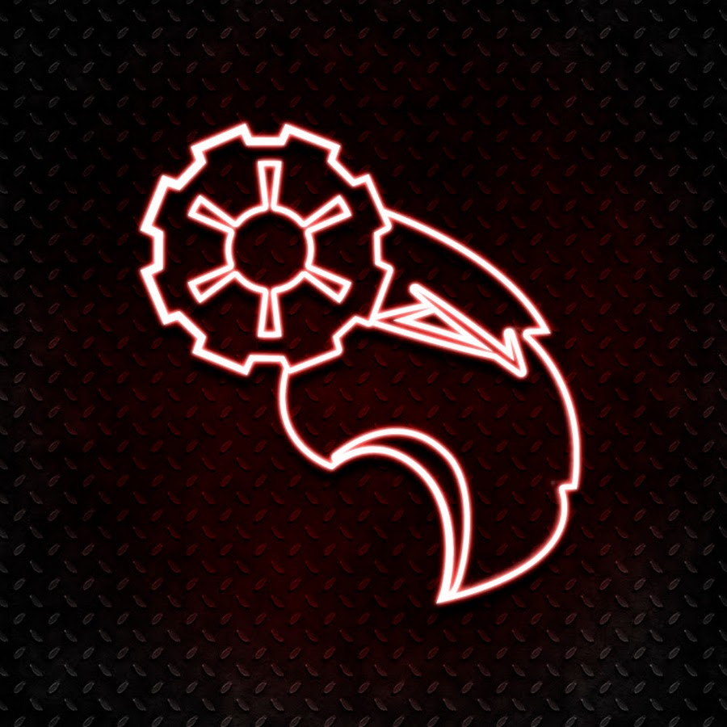

# FRC4403_2022 :ram:
FIRST Robotics Competition code :computer: for the 2022 season. :video_game: 

## Purpose :wrench:
The code in this project was created for {nombre de robot}, robot of Team 4403 ROULT of PrepaTec Campus Laguna. {nombre de robot} was designed to participate in the FIRST Robotics Competition (FRC) 2022 season, Rapid React :copyright:.

## Content
This project contains the code used to control different parts of {nombre de robot}. As a team, we map the robot's subsystems such as {listar subsistemas}. The trajectories used for the autonomous routines during the competiton. We define the correct configuration of widgets used in the Shuffleboard in order for the Drive Team to have an optimal experience during the competition.

## Auto

## Subsystems

## Vision

## SubAutonomous Routines

 

  
Team ROULT 4403.  

